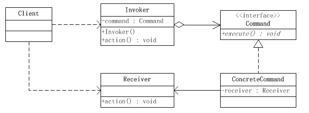

# command-demo
命令模式demo

# 定义
命令模式属于对象的行为模式。命令模式又称为行动(Action)模式或者交易(Transaction)模式。

命令模式把一个请求或者操作封装到一个对象中。命令模式允许系统使用不同的请求把客户端参数化，对请求排队或者记录请求日志，可以提供命令的撤销和恢复功能。

# 命令模式的结构
命令模式是对命令的封装。命令模式把发出命令的责任和执行命令的责任分隔开，委派给不同的对象。

每一个命令都是一个操作：请求的一方发出请求要求执行一个操作；接收的一方接收到请求，并执行操作。命令模式允许请求的一方和接收的一方独立开来，使得请求的一方不必知道接收请求的一方的接口，更不必知道请求是怎么被接收、以及操作是否被执行、何时被执行、怎么被执行的。

命令允许请求的一方和接收请求的一方能够独立演化，从而具有如下的优点：

- 命令模式使新的命令很容易被加入到系统里。
- 允许接受请求的一方决定是否要否决请求。 
- 能较容易的设计一个命令队列。
- 可以容易的实现对请求的撤销和恢复。
- 在需要的情况下，可以较容易的将命令记入日志。

下面是一个示意性的系统，说明命令模式的结构：

命令模式涉及到五个角色，他们分别是：

- 客户端角色(Client)：创建一个具体命令ConcreteCommand对象并确定其接收者。
- 命令角色(Command)： 声明一个给所有具体命令类的抽象接口。
- 具体命令角色(ConcreteCommand)：定义一个接收者和行为之间的弱耦合；实现execute()方法，负责调用接收者的相应操作。execute()方法通常叫做执行方法。
- 请求者角色(Invoker)：负责调用命令对象执行请求，相关的方法叫做行动方法。
- 接收者角色(pers.ocean.base.Receiver)：负责具体实施和执行一个请求。任何一个类都可以成为接收者，实施和执行请求的方法叫做行动方法。

# case
小女孩茱莉(Julia)有一个盒式录音机，此录音机有播音Play、倒带Rewind、停止Stop功能。录音机的键盘便是请求者角色Invoker；茱莉(Julia)是客户端角色Client，而录音机便是接收者角色Receiver。

Command类扮演抽象命令角色，而PlayCommand、StopCommand、RewindCommand便是具体命令类。茱莉(Julia)不需要知道播音、倒带、停止功能是怎么具体执行的，这些命令的执行细节全部由键盘Keypad具体实施。茱莉(Julia)只需要在键盘上按下相应的键就可以了。

# 宏命令
所谓宏命令简单点就是包含多个命令的命令，是一个命令的组合。

设想茱莉的录音机有一个记录功能，可以把一个一个的命令记录下来，再在任何需要的时候重新把这些记录下来的命令一次性执行，这就是所谓的宏命令集功能。因此，茱莉的录音机系统现在有四个键，分别为播音、倒带、停止和宏命令功能。此时系统的设计和前面的设计相比有所增强，主要体现在Julia类有了一个新方法，用以操作宏命令键。